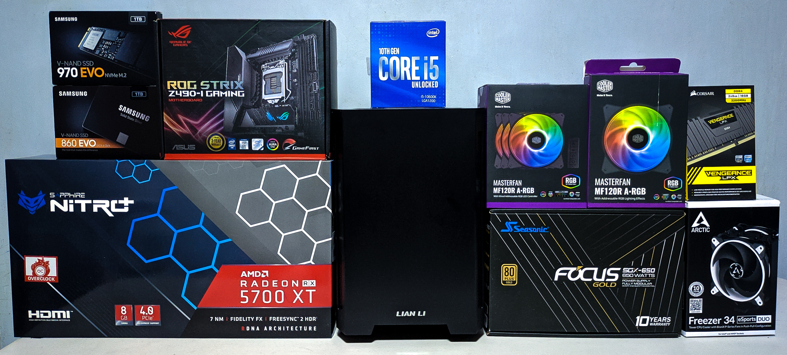
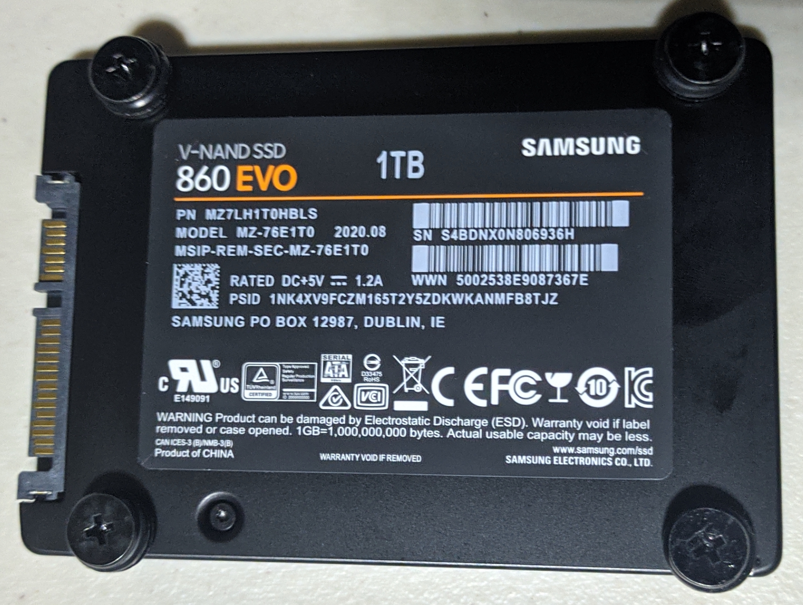

# Assembly

## Tools
---
* Screwdriver/s (preferrably magnetic)
* Long nose pliers

## Motherboard
---
1. Prepare all your parts.
    
2. Unbox the ASUS Strix z490-i motherboard. Inspect for damages and learn all the connector ports.
    
3. Install the Intel i5-10600k and the Corsair Vengeance RAM sticks.
    
    
    
4. Hard part! Replacing the stock Intel WiFi card with the BCM943602CS. First, Remove the triple deck heatsink for the NVME slots. Next, remove the following screws from the back of the motherboard.
    
5. Before completely removing the Heatsink / I/O shield, carefully remove the VRM fan header and the tape.
    
    
6. Take note of the placement of the VRM Heatsink thermal pads!
    
7. Set aside the Heatsink / I/O shield. Remove the additional screw for the Intel WiFi chip.
    
8. Carefully pull out the Intel WiFi chip.
    
9.  Open the Intel WiFi chip and carefully pry off the antenna cables from the chip. Replace the antenna cables with the ones included in the WiFi Antenna Set.
    
10. Before completely closing the Intel WiFi chip, bend the top a little bit so that the longer cables have a place to pass thru.
    
11. Return everything starting from the Intel WiFi chip, the additional screw, VRM fan header, heatsink and the bottom screws.
    
12. Install the Samsung 970 evo NVME ssd on the top side.
    
13. Assemble the BCM943602CS and B+M Adapter. Install this on the bottom side.
    
14. Attach the bluetooth antenna cable and WiFi antenna cables.
    
    
15. Attach the USB 2 header on the B+M Adapter and motherboard.
    
16. Reassemble the triple deck heatsink for the NVME slots.
    * The bottom heatsink should be set aside since it won't fit due to the BCM943602CS and B+M Adapter.
    * Make sure you remove the thermal pad cover for the top part before installing everything back.
    * Tip: Tuck the cables inside the heatsink for better cable management. Just be sure to not bend the cables to much. Hard part is done!
    
    
    
17. Install the CPU cooler mounts.
    
    

## Case
---
1. Install the power supply.
    
    
2. Install the bottom case fan/s (intake).
    
3. Install the rear case fan (exhaust).
   * Case fans should be daisy chained using the PWN Fan splitter.
   * If fans have rgb, they should also be daisy chained using the ARGB splitter/
    
    
4. Install the motherboard in the case.
    
5. Attach the front I/O cables, and cable extensions (if you have).
    
6. Install the GPU.
    
7. Assemble the SATA SSD/s.
    
8. Before installing the SATA SSD/s in the case, make sure that the SATA power and data cables are already attached.
    
9.  Mount the SSD/s in your case.
    
10. Attach all the PSU cables.
    
11. Install the front case fan (intake).
    
12. Apply a pea sized thermal paste on your CPU.
    
13. Install the CPU Cooler heatsink without the fans.
    
14. Install the CPU Cooler fans. And you're done!
    
15. Boot and check in your BIOS if everything is detected.
    
    
16. Cable management time!
