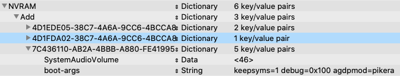

# Hackintosh

## Software
---

* Bootloader: OpenCore 0.6.4-DEBUG
* OS: macOS Catalina 10.15.7 (19H15)

## BIOS
---
> Version: 0901

### Disable

* Fast Boot

* VT-d

* Launch CSM

* Software Guard Extensions (SGX)

* CFG Lock (no option in BIOS, Asus Z490 motherboards are factory unlocked. The `AppleCpuPmCfgLock` and `AppleXcpmCfgLock` quirks are not necessary)

### Enable

* VT-x (no option in BIOS, it's enabled by default)
* Above 4G Decoding

* XHCI Hand-off

* Hyper-Threading

* OS type: Windows UEFI Mode (if `Secure boot keys: Cleared`) or OS type: Other OS

* DVMT Pre-Allocated: 64MB (only available if `OS type: Other OS`)

* SATA Mode Selection: AHCI

* Multi monitor mode: Enabled


## Bootable USB, EFI and Installation
---

The installation guide in the [OpenCore Install Guide](https://dortania.github.io/OpenCore-Install-Guide/) are quite clear and easy, so there will be no detailed installation tutorials here. Give it some patience and you can build your own EFI.

### Tools
* [gibMacOS](https://github.com/corpnewt/gibMacOS)
* [MountEFI](https://github.com/corpnewt/MountEFI)
* [ProperTree](https://github.com/corpnewt/ProperTree)
* [GenSMBIOS](https://github.com/corpnewt/GenSMBIOS)
* [Sanity Checker](https://opencore.slowgeek.com/)

## Post Install
---


### Tools
* [neofetch](https://github.com/dylanaraps/neofetch)
* [hackintool](https://github.com/headkaze/Hackintool/releases)

### Audio
---
> Realtek ALCS122A

#### Tools
* [gfxutil](https://github.com/acidanthera/gfxutil/releases)
* [IORegistryExplorer](https://github.com/khronokernel/IORegistryClone/blob/master/ioreg-302.zip)

#### Kexts
* [FakePCIID](https://github.com/RehabMan/OS-X-Fake-PCI-ID)

#### Issues
* Choppy audio output
   1. Run `gfxutil -f HDEF` in Terminal.
    ```
    $ gfxutil-1.80b-RELEASE/gfxutil -f HDEF
    00:1f.3 8086:9d70 /PCI0@0/HDEF@1F,3 = PciRoot(0x0)/Pci(0x1F,0x3)
    ```
   2. Insert/update `DeviceProperties` -> `Add` -> `PciRoot(0x0)/Pci(0x1F,0x3)`. Use `layout-id: 7`
    
   3. Remove `alcid` from `NVRAM` -> `Add` -> `7C436110-AB2A-4BBB-A880-FE41995C9F82`
    
   4. Reboot and test audio.

* Intel HDMI Audio not showing

   1. Insert `FakePCIID.kext` and `FakePCIID_Intel_HDMI_Audio.kext` in your kexts folder and update config.plist.
    
   2. Update `DeviceProperties` -> `Add` -> `PciRoot(0x0)/Pci(0x1F,0x3)`. Use `device-id: <709D0000>`
    
   3. Reboot and test HDMI audio. It should show in Hackintool after restart.
    

* Only 1 audio output port is working (Front Panel)

#### Not Tested
* Audio input ports

### DRM
---

* Hardware Accelaration works out of the box (if `Multi monitor mode: Enabled` in BIOS)
```
$ VDADecoderChecker
Hardware acceleration is fully supported
```
* FairPlay 1.x works out of the box
* FairPlay 2.x/3.x works out of the box

#### Tools
* [VDADecoderChecker](https://i.applelife.ru/2019/05/451893_10.12_VDADecoderChecker.zip)
* [VideoProc](https://www.videoproc.com/)
* [Google Chrome](https://www.google.com/intl/en_ph/chrome/) - used to test FairPlay 2.x/3.x

#### Issues
* iGPU showing in videoproc instead of dGPU
    

#### Not Tested
* FairPlay 4.x

### iGPU
---
> Intel UHD Graphics 630

#### Issues
* iGPU not showing

   1. Update `DeviceProperties` -> `Add` -> `PciRoot(0x0)/Pci(0x2,0x0)`. Use `device-id: <9B3E0000>`
    
   2. Reboot. It should show in Hackintool after restart.
    

### dGPU
---
* Sapphire Nitro+ rx 5700XT Works out of the box

#### Kexts
* [RadeonBoost](https://www.insanelymac.com/forum/topic/343461-kext-tired-of-low-geekbench-scores-use-radeonboost/) - not working on 10.15.5 and up

### Wi-Fi
---
* BCM943602CS works out of the box
    
* The following kexts are NOT needed:
  * AirportBrcmFixup.kext
  * BrcmPatchRAM.kext
  * BrcmPatchRAM3.kext
  * BrcmBluetoothInjector.kext

### Bluetooth
---
* BCM943602CS works out of the box but [USB Mapping](#USB-Map) is needed

#### Issues
* Can't toggle on or off state of bluetooth / Can't search bluetooth devices
    
  1. Fix [USB Mapping](#USB-Map)
  2. Reboot and test your bluetooth connectivity.
    

* Bluetooth speakers/earphones are choppy
    1. Wi-Fi should be connected on 5Ghz to lessen bluetooth interruption.
    2. Or use Apple Airpods.

### Ethernet
---
> Intel I225-V 2.5Gbit

#### Issues
* ethernet not showing in Network Preferences

   
   1. Insert `FakePCIID.kext` and `FakePCIID_Intel_I225-V.kext` in your kexts folder and update config.plist.
    
   2. Change `DeviceProperties` -> `Add` -> `PciRoot(0x0)/Pci(0x1C,0x1)/Pci(0x0,0x0)` to `DeviceProperties` -> `Add` -> `PciRoot(0x0)/Pci(0x1C,0x4)/Pci(0x0,0x0)`
   3. Update `DeviceProperties` -> `Add` -> `PciRoot(0x0)/Pci(0x1C,0x4)/Pci(0x0,0x0)`. Use `device-id: <F2150000>`
    
   4. Reboot and test ethernet connection. It should show in Network Preferences after restart.
    

#### Not tested
1. Actual ethernet cable connection

### Others
---
* `iServices` works out of the box. Tested the following:
  * App Store
* `Power Management` works out of the box
* `Sleep/Wake` works out of the box

### USB Map

#### Tools
* [USBMap]()

#### Fixes

##### Port Mapping
1. Insert USBMap.kext in your kexts folder. Update config.plist (cmd + R)
2. Set XCHIPortLimit to False


### F1 Boot error

Set DisableRtcChecksum to True


#### Fixes


Beautify

1. Boot GUI
 * OpenCanopy efi
 * Binary Resources
 * OpenCanopy-Big-Sur

2. Remove debug logs
* Misc -> Debug -> AppleDebug -> False
* remove -v from boot-args
* Misc -> Debug -> Target : 3
* No need to change opencore debug version to release

#### Not Enough Disk Space to Copy EFI
sudo -s
diskutil list
newfs_msdos -v EFI /dev/diskNsN

Others:
Fix ROM

## Credits

* [OpenCore Install Guide](https://dortania.github.io/OpenCore-Install-Guide/)
* [Hackintosh-ROG-STRIX-Z490I](https://github.com/jergoo/Hackintosh-ROG-STRIX-Z490I)