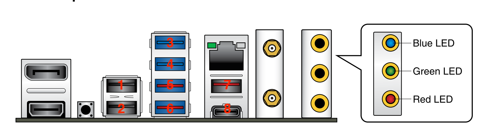
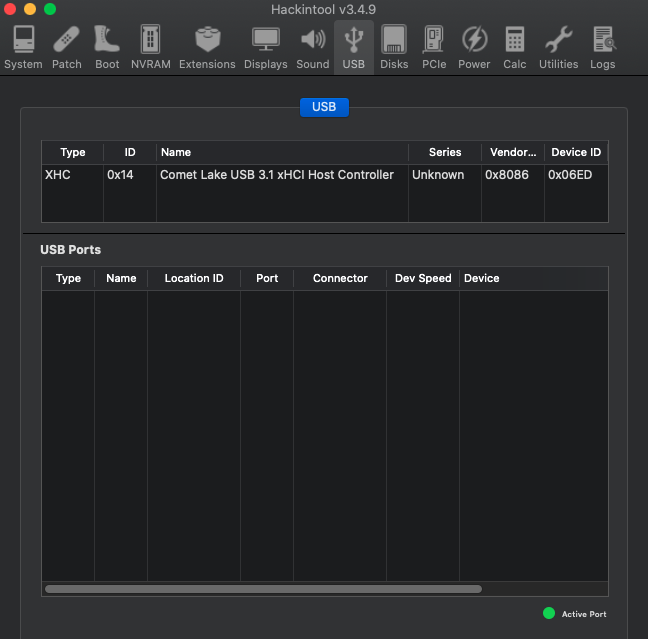

# Hackintosh

## Software
---

* Bootloader: OpenCore 0.6.4-DEBUG
* OS: macOS Catalina 10.15.7 (19H15)

## BIOS
---
> Version: 0901

### Disable

* Fast Boot

    

* VT-d

    

* Launch CSM

    

* Software Guard Extensions (SGX)

    

* CFG Lock (no option in BIOS, Asus Z490 motherboards are factory unlocked. The `AppleCpuPmCfgLock` and `AppleXcpmCfgLock` quirks are not necessary)

### Enable

* VT-x (no option in BIOS, it's enabled by default)
* Above 4G Decoding

    

* XHCI Hand-off

    

* Hyper-Threading

    

* OS type: Windows UEFI Mode (if `Secure boot keys: Cleared`) or OS type: Other OS

    

* DVMT Pre-Allocated: 64MB (only available if `OS type: Other OS`)

    

* SATA Mode Selection: AHCI

    

* Multi monitor mode: Enabled

    

## Bootable USB, EFI and Installation
---

The installation guide in the [OpenCore Install Guide](https://dortania.github.io/OpenCore-Install-Guide/) are quite clear and easy, so there will be no detailed installation tutorials here. Give it some patience and you can build your own EFI.

### Tools
* [gibMacOS](https://github.com/corpnewt/gibMacOS)
* [MountEFI](https://github.com/corpnewt/MountEFI)
* [ProperTree](https://github.com/corpnewt/ProperTree)
* [GenSMBIOS](https://github.com/corpnewt/GenSMBIOS)
* [Sanity Checker](https://opencore.slowgeek.com/)

## Post Install
---


### Tools
* [neofetch](https://github.com/dylanaraps/neofetch)
* [hackintool](https://github.com/headkaze/Hackintool/releases)

### Audio
---
> Realtek ALCS122A

#### Tools
* [gfxutil](https://github.com/acidanthera/gfxutil/releases)
* [IORegistryExplorer](https://github.com/khronokernel/IORegistryClone/blob/master/ioreg-302.zip)

#### Kexts
* [FakePCIID](https://github.com/RehabMan/OS-X-Fake-PCI-ID)

#### Issues
* Choppy audio output
   1. Run `gfxutil -f HDEF` in Terminal.
    ```
    $ gfxutil-1.80b-RELEASE/gfxutil -f HDEF
    00:1f.3 8086:9d70 /PCI0@0/HDEF@1F,3 = PciRoot(0x0)/Pci(0x1F,0x3)
    ```
   2. Insert/update `DeviceProperties` -> `Add` -> `PciRoot(0x0)/Pci(0x1F,0x3)`. Use `layout-id: 7`

        

   3. Remove `alcid` from `NVRAM` -> `Add` -> `7C436110-AB2A-4BBB-A880-FE41995C9F82`

        

   4. Reboot and test audio.

* Intel HDMI Audio not showing

    

   1. Insert `FakePCIID.kext` and `FakePCIID_Intel_HDMI_Audio.kext` in your kexts folder and update config.plist.

        

   2. Update `DeviceProperties` -> `Add` -> `PciRoot(0x0)/Pci(0x1F,0x3)`. Use `device-id: <709D0000>`

        

   3. Reboot and test HDMI audio. It should show in Hackintool after restart.

        

* Only 1 audio output port is working (Front Panel)

#### Not Tested
* Audio input ports

### DRM
---

* Hardware Accelaration works out of the box (if `Multi monitor mode: Enabled` in BIOS)
```
$ VDADecoderChecker
Hardware acceleration is fully supported
```
* FairPlay 1.x works out of the box
* FairPlay 2.x/3.x works out of the box

#### Tools
* [VDADecoderChecker](https://i.applelife.ru/2019/05/451893_10.12_VDADecoderChecker.zip)
* [VideoProc](https://www.videoproc.com/)
* [Google Chrome](https://www.google.com/intl/en_ph/chrome/) - used to test FairPlay 2.x/3.x

#### Issues
* iGPU showing in videoproc instead of dGPU

    

#### Not Tested
* FairPlay 4.x

### iGPU
---
> Intel UHD Graphics 630

#### Issues
* iGPU not showing

    

   1. Update `DeviceProperties` -> `Add` -> `PciRoot(0x0)/Pci(0x2,0x0)`. Use `device-id: <9B3E0000>`

        

   2. Reboot. It should show in Hackintool after restart.

        

### dGPU
---
* Sapphire Nitro+ rx 5700XT Works out of the box

#### Kexts
* [RadeonBoost](https://www.insanelymac.com/forum/topic/343461-kext-tired-of-low-geekbench-scores-use-radeonboost/) - not working on 10.15.5 and up

### Wi-Fi
---
* BCM943602CS works out of the box

    

* The following kexts are NOT needed:
  * AirportBrcmFixup.kext
  * BrcmPatchRAM.kext
  * BrcmPatchRAM3.kext
  * BrcmBluetoothInjector.kext

### Bluetooth
---
* BCM943602CS works out of the box but [USB Mapping](#USB-Map) is needed

#### Issues
* Can't toggle on or off state of bluetooth / Can't search bluetooth devices

    

  1. Fix [USB Mapping](#USB-Map)
  2. Reboot and test your bluetooth connectivity.

        

* Bluetooth speakers/earphones are choppy
    1. Wi-Fi should be connected on 5Ghz to lessen bluetooth interruption.
    2. Or use Apple Airpods.

### Ethernet
---
> Intel I225-V 2.5Gbit

#### Issues
* ethernet not showing in Network Preferences

   

   1. Insert `FakePCIID.kext` and `FakePCIID_Intel_I225-V.kext` in your kexts folder and update config.plist.

        

   2. Change `DeviceProperties` -> `Add` -> `PciRoot(0x0)/Pci(0x1C,0x1)/Pci(0x0,0x0)` to `DeviceProperties` -> `Add` -> `PciRoot(0x0)/Pci(0x1C,0x4)/Pci(0x0,0x0)`
   3. Update `DeviceProperties` -> `Add` -> `PciRoot(0x0)/Pci(0x1C,0x4)/Pci(0x0,0x0)`. Use `device-id: <F2150000>`

        

   4. Reboot and test ethernet connection. It should show in Network Preferences after restart.

        


#### Not tested
1. Actual ethernet cable connection

### Others
---
* `iServices` works out of the box
  * Make sure to fix [`ROM`](https://dortania.github.io/OpenCore-Post-Install/universal/iservices.html#fixing-rom)
  * Tested the following:
    * App Store
* `Power Management` works out of the box
* `Sleep/Wake` works out of the box

#### Issues
* F1 Boot Error

    

   1. Set `Kernel` -> `Quirks` -> `DisableRtcChecksum` to `True`

        

   2. Reboot and F1 boot error should be gone

* Not Enough Disk Space while updating EFI
  ```
  $ sudo -s
  $ diskutil list
  $ newfs_msdos -v EFI /dev/diskNsN -- where diskNsN is the EFI partition
  ```

### USB Map
---
All ports are working except for the ones disabled due to the 15 port limit.

#### Tools
* [USBMap](https://github.com/corpnewt/USBMap)

#### Port Mapping
* Use this as a reference for your USB Mapping:

    
    

    | No. | Type | Port |
    |-----|------|------|
    | 1   | USB 2.0 | HS12 |
    | 2   | USB 2.0 | HS13 |
    | 3   | USB 3.2 Gen 1 | HS09/SS09 |
    | 4   | USB 3.2 Gen 1 | HS10/SS10 |
    | 5   | USB 3.2 Gen 2 | HS05/SS05 |
    | 6   | USB 3.2 Gen 2 | HS06/SS06 |
    | 7   | USB 3.2 Gen 2 | HS03/SS03 |
    | 8   | USB 3.2 Gen 2 | HS04/SS04 |
    | 9   | USB 2.0 Hub | HS14 |
    | 10  | USB 2.0 Hub | HS11 |
    | 11  | USB 2.0 Hub | HS02 |
    | 12  | USB 3.2 Gen 1 | HS07/SS07 + HS08/SS08 |
    | 13  | USB 3.2 Gen 2 | HS01/SS01 + SS02 |

#### USB Map Configuration
* Before updating config.plist
```
  #######################################################
 #                  Edit USB Ports                     #
#######################################################

    ----- XHC@14 Controller -----
[ ] 1. AppleUSB20XHCIPort | 14100000 | Type 0
    HS01 (USB 3.2 Gen 2 Type-C, Front, 2.0P)
[ ] 2. AppleUSB20XHCIPort | 14200000 | Type 0
    HS02 (ARGB/RGB Header)
    - AURA LED Controller
[ ] 3. AppleUSB20XHCIPort | 14300000 | Type 0
    HS03 (USB 3.2 Gen 2 Type-A, Rear, 3rd, Mid, 2.0P)
[#] 4. AppleUSB20XHCIPort | 14400000 | Type 0
    HS04 (USB 3.2 Gen 2 Type-C, Rear, 2.0P)
[#] 5. AppleUSB20XHCIPort | 14500000 | Type 0
    HS05 (USB 3.2 Gen 2 Type-A, Rear, 2nd, Mid left, 2.0P)
[#] 6. AppleUSB20XHCIPort | 14600000 | Type 0
    HS06 (USB 3.2 Gen 2 Type-A, Rear, 2nd, Left most (Alum), 2.0P)
[#] 7. AppleUSB20XHCIPort | 14700000 | Type 0
    HS07 (USB 3.2 Gen 1 Type-A, Front, Left, 2.0P)
[#] 8. AppleUSB20XHCIPort | 14800000 | Type 0
    HS08 (USB 3.2 Gen 1 Type-A, Front, Right, 2.0P)
[#] 9. AppleUSB20XHCIPort | 14900000 | Type 0
    HS09 (USB 3.2 Gen 1 Type-A, Rear, 2nd, Right most (Temp), 2.0P)
[#] 10. AppleUSB20XHCIPort | 14a00000 | Type 0
    HS10 (USB 3.2 Gen 1 Type-A, Rear, 2nd, Mid right, 2.0P)
    - USB2.1 Hub
        - AppleUSB20Hub
            - G102 LIGHTSYNC Gaming Mouse
            - Keychron K8
[#] 11. AppleUSB20XHCIPort | 14b00000 | Type 255
    HS11 (Internal USB 2.0 Header, BCM Chip and Adapter)
    - USB2.0 Hub
        - AppleUSB20Hub
            - Bluetooth USB Host Controller
[ ] 12. AppleUSB20XHCIPort | 14c00000 | Type 0
    HS12 (USB 2.0 Type-A, Rear, 1st, Right (Temp))
[ ] 13. AppleUSB20XHCIPort | 14d00000 | Type 0
    HS13 (USB 2.0 Type-A, Rear, 1st, Left (Alum))
[ ] 14. AppleUSB20XHCIPort | 14e00000 | Type 3
    HS14 (Onboard Bluetooth (?))
    - IOBluetoothHostControllerUSBTransport
[ ] 15. AppleUSB20XHCIPort | 14f00000 | Type 3
    USR1
[ ] 16. AppleUSB20XHCIPort | 14000000 | Type 3
    USR2
[ ] 17. AppleUSB30XHCIPort | 14100000 | Type 10
    SS01 (USB 3.2 Gen 2 Type-C, Rear, 3.0P)
[ ] 18. AppleUSB30XHCIPort | 14200000 | Type 10
    SS02 (USB 3.2 Gen 2 Type-C, Rear, 3.0P)
[ ] 19. AppleUSB30XHCIPort | 14300000 | Type 3
    SS03 (USB 3.2 Gen 2 Type-A, Rear, 3rd, Mid, 3.0P)
[#] 20. AppleUSB30XHCIPort | 14400000 | Type 9
    SS04 (USB 3.2 Gen 2 Type-C, Rear, 3.0P)
[#] 21. AppleUSB30XHCIPort | 14500000 | Type 3
    SS05 (USB 3.2 Gen 2 Type-A, Rear, 2nd, Mid left, 3.0P)
[#] 22. AppleUSB30XHCIPort | 14600000 | Type 3
    SS06 (USB 3.2 Gen 2 Type-A, Rear, 2nd, Left most (Alum), 3.0P)
[#] 23. AppleUSB30XHCIPort | 14700000 | Type 3
    SS07 (USB 3.2 Gen 1 Type-A, Front, Left, 3.0P)
    - SanDisk 3.2Gen1
[#] 24. AppleUSB30XHCIPort | 14800000 | Type 3
    SS08 (USB 3.2 Gen 1 Type-A, Front, Right, 3.0P)
[#] 25. AppleUSB30XHCIPort | 14900000 | Type 3
    SS09 (USB 3.2 Gen 1 Type-A, Rear, 2nd, Right most (Temp), 3.0P)
[#] 26. AppleUSB30XHCIPort | 14a00000 | Type 3
    SS10 (USB 3.2 Gen 1 Type-A, Rear, 2nd, Mid right, 3.0P)
    - USB3.1 Hub
```


1. Generate and insert `USBMap.kext` in your kexts folder and update config.plist
2. Set `Kernel` -> `Quirks` -> `XhciPortLimit` to `False`

    

3. Reboot and check your USB map.

    ```
    #######################################################
    #                Discover USB Ports                   #
    #######################################################

        ----- XHC@14 Controller -----
    1. HS04 | 04000000 | 14100000
        HS04 (USB 3.2 Gen 2 Type-C, Rear, 2.0P)
    2. HS05 | 05000000 | 14200000
        HS05 (USB 3.2 Gen 2 Type-A, Rear, 2nd, Mid left, 2.0P)
    3. HS06 | 06000000 | 14300000
        HS06 (USB 3.2 Gen 2 Type-A, Rear, 2nd, Left most (Alum), 2.0P)
    4. HS07 | 07000000 | 14400000
        HS07 (USB 3.2 Gen 1 Type-A, Front, Left, 2.0P)
    5. HS08 | 08000000 | 14500000
        HS08 (USB 3.2 Gen 1 Type-A, Front, Right, 2.0P)
    6. HS09 | 09000000 | 14600000
        HS09 (USB 3.2 Gen 1 Type-A, Rear, 2nd, Right most (Temp), 2.0P)
    7. HS10 | 0a000000 | 14700000
        HS10 (USB 3.2 Gen 1 Type-A, Rear, 2nd, Mid right, 2.0P)
        - USB2.1 Hub
            - AppleUSB20Hub
                - Keychron K8
                - G102 LIGHTSYNC Gaming Mouse
    8. HS11 | 0b000000 | 14800000
        HS11 (Internal USB 2.0 Header, BCM Chip and Adapter)
        - USB2.0 Hub
            - AppleUSB20InternalHub
                - Bluetooth USB Host Controller
    9. SS04 | 14000000 | 14900000
        SS04 (USB 3.2 Gen 2 Type-C, Rear, 3.0P)
    10. SS05 | 15000000 | 14a00000
        SS05 (USB 3.2 Gen 2 Type-A, Rear, 2nd, Mid left, 3.0P)
    11. SS06 | 16000000 | 14b00000
        SS06 (USB 3.2 Gen 2 Type-A, Rear, 2nd, Left most (Alum), 3.0P)
    12. SS07 | 17000000 | 14c00000
        SS07 (USB 3.2 Gen 1 Type-A, Front, Left, 3.0P)
    13. SS08 | 18000000 | 14d00000
        SS08 (USB 3.2 Gen 1 Type-A, Front, Right, 3.0P)
    14. SS09 | 19000000 | 14e00000
        SS09 (USB 3.2 Gen 1 Type-A, Rear, 2nd, Right most (Temp), 3.0P)
    15. SS10 | 1a000000 | 14f00000
        SS10 (USB 3.2 Gen 1 Type-A, Rear, 2nd, Mid right, 3.0P)
        - USB3.1 Hub
    ```
    

### Cleanup
---
* Boot GUI
  * used this [icon pack](https://github.com/blackosx/OpenCanopyIconPacks/tree/master/BOCIP_1_Dark)

* Remove debug logs
  * Set `Misc` -> `Debug` -> `AppleDebug` to `False`
  * Set `Misc` -> `Debug` -> `Target` to `3`

    

  * Remove `-v` from boot-args`NVRAM` -> `Add` -> `7C436110-AB2A-4BBB-A880-FE41995C9F82`

    

  * Note: No need to change opencore debug version to release

## Benchmarks
---
* Cinebench

    

* Geekbench 5.1
    * CPU : [1222 / 6360](https://browser.geekbench.com/v5/cpu/5224098)

        

    * dGPU (Open/Metal: [51563](https://browser.geekbench.com/v5/compute/2019460) / [41380](https://browser.geekbench.com/v5/compute/2019471))

        
        

    * iGPU (Open/Metal: [2206](https://browser.geekbench.com/v5/compute/2019466) / [4815](https://browser.geekbench.com/v5/compute/2019489))

        
        

* Intel Power Gadget

    


## Credits
---
* [OpenCore Install Guide](https://dortania.github.io/OpenCore-Install-Guide/)
* [Hackintosh-ROG-STRIX-Z490I](https://github.com/jergoo/Hackintosh-ROG-STRIX-Z490I)